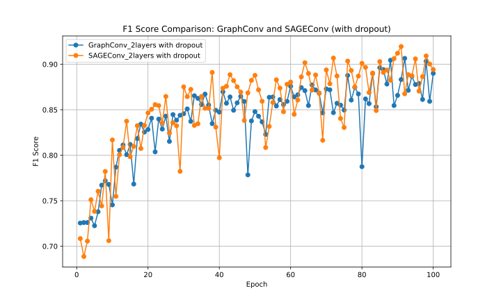
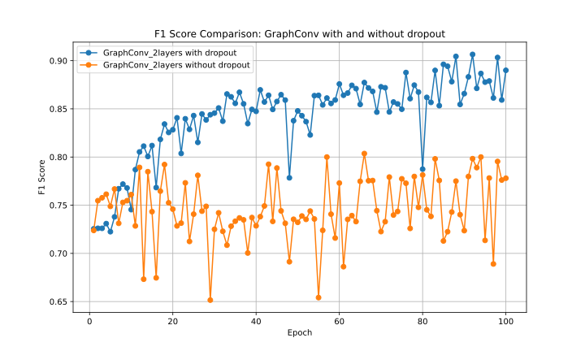
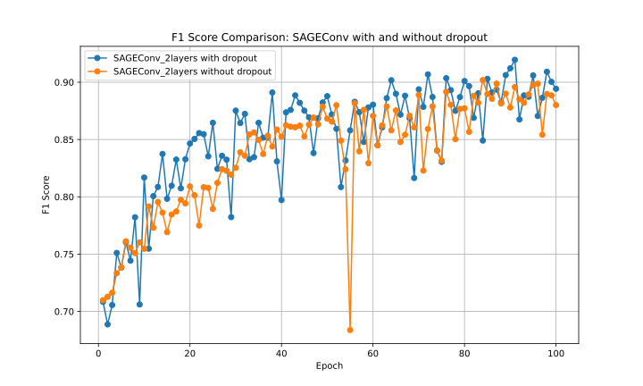

<!--suppress ALL -->

<div align="center">
    <!-- -->
	<h1 style="padding-bottom: .3em !important; border-bottom: 1.5px solid #d0d7deb3 !important;">CialloDroid</h1>
</div>

<h2 align="center" style="border-bottom-style: none !important;"> 信息安全创新综合实验——基于图神经网络的安卓恶意软件检测模型 </h2>

<p align="center" style="text-align:center">Ciallo ～(∠・ω< )⌒★</p>

<p align="center" style="text-align:center">
    
    
    
    
</p>

<p  align="center" style="text-align:center"> 中文 | <a href="README.md"> English </a> </p>

## 任务书

### 任务简介

安卓操作系统作为移动设备上最广泛使用的开放源代码操作系统，具有着丰富的应用市场与客户人群，但其普及率与快速的增长也为恶意软件发展提供了温床。

为此，现有研究者通过提取程序特征来实现恶意软件检测机制。但是这些方法往往 **忽视了程序语义信息**，导致恶意软件检测精度不理想。

为此，该系统设计题目需要针对安卓应用软件，**引入图卷积神经网络**，能够将程序语义关系转换为图模型，进而采用图分析方法，实现精确度高、检测速度快的恶意软件检测方法。

### 相关工作

现有基于深度学习的安卓恶意软件检测方法主要可以分为 **基于语法特征** 和 **基于语义特征** 的检测方法。

基于语法特征的方法主要关注于代码的语法结构，通过从语法结构中提取出代表性的特征与恶意行为标签，来训练模型从而实施检测。该方法的优点在于可以快速准确地识别简单和常见的恶意代码，但是对于复杂和高级的恶意软件则表现出相对较差的准确性和效率。

基于语义特征的方法通常通常会采用程序分析技术。程序分析是一种将程序的行为抽象为数学模型的技术，以便进一步展示和分析，相比于基于语法特征的方法，该方法可以更好地识别复杂和高级的恶意软件，以及从中提取有用的信息。通过程序分析，研究者可以更好地提取恶意软件执行过程中的语义信息，以理解其行为和特征，这类特征往往会通过图和数据流的方法进行表达。

### 可行方法

该系统可行的方法是对安卓应用程序首先进行静态分析，提取应用程序的函数调用图，并利用现有 [敏感 API 数据集](https://apichecker.github.io/) 对函数调用图进行自动标注。然后设计图卷积神经网络模型，并通过 One-Hot 编码实现对函数调用图的特征编码，对图卷积神经网络模型每个节点特征向量进行初始化，最后利用现有数据集对模型进行训练。

其中安卓应用程序静态分析工具可以采用 [Androguard](https://github.com/androguard/androguard)。恶意安卓应用可以从 [VirusShare](https://virusshare.com/) 平台上下载，正常安卓应用可以从 [AndroZoo](https://androzoo.uni.lu/) 平台上下载。


### 任务要求

1. 查阅相关资料，了解恶意软件检测的原理；
2. 设计实现安卓应用程序的函数调用图提取及其敏感 API 调用自动标注方法；
3. 设计实现基于图卷积神经网络模型的安卓恶意软件模型训练方法；
4. 设计实验分析方法，要求测试恶意应用和正常应用均不少于 50 个，评估模型的准确率、召回率和 F1 得分；
5. 根据小组分工，撰写个人课程报告，形成整体作品报告。

## 项目环境

- Python 3.9
- androguard==3.4.0a1
- dgl==2.4.0+cu121
- matplotlib==3.9.2
- networkx==3.2.1
- numpy==2.1.3
- plotly==5.24.1
- pygtrie==2.5.0
- Requests==2.32.3
- scikit_learn==1.5.2
- torch==2.4.0

## 实验结果

### 2 层卷积层结果

```
(yolov10) ubuntu@nwpu:~/ciallo$ python train_model.py 
2024-11-25 19:18:21,846 - Initializing data module...
2024-11-25 19:18:30,043 - Dataset Statistics:
2024-11-25 19:18:30,043 -   Total Samples: 5297
2024-11-25 19:18:30,043 -   Training Samples: 4237, Validation Samples: 529, Test Samples: 531
2024-11-25 19:18:30,044 - Dataset Statistics:
2024-11-25 19:18:30,044 -   Total Samples: 5297
2024-11-25 19:18:30,044 -   Training Samples: 4237, Validation Samples: 529, Test Samples: 531
2024-11-25 19:18:41,574 -   Training Set - Benign: 1830, Malicious: 2407
2024-11-25 19:18:41,574 - Initializing model...
2024-11-25 19:18:44,080 - Starting training...
2024-11-25 19:18:44,080 - Epoch 1/20
2024-11-25 19:19:03,425 - Train Loss: 88.3321, Accuracy: 0.5936, Time: 19.34s
2024-11-25 19:19:06,146 - Validation Loss: 11.1556, Accuracy: 0.5898, Precision: 0.5803, Recall: 1.0000, F1 Score: 0.7344
2024-11-25 19:19:06,179 - Epoch 1 Results: Train Loss = 88.3321, Train Acc = 0.5936, Val Loss = 11.1556, Val Acc = 0.5898, Precision = 0.5803, Recall = 1.0000, F1 = 0.7344
2024-11-25 19:19:06,179 - Epoch 2/20
2024-11-25 19:19:20,213 - Train Loss: 87.3220, Accuracy: 0.6203, Time: 14.03s
2024-11-25 19:19:22,913 - Validation Loss: 10.9395, Accuracy: 0.6144, Precision: 0.5968, Recall: 0.9867, F1 Score: 0.7437
2024-11-25 19:19:22,948 - Epoch 2 Results: Train Loss = 87.3220, Train Acc = 0.6203, Val Loss = 10.9395, Val Acc = 0.6144, Precision = 0.5968, Recall = 0.9867, F1 = 0.7437
2024-11-25 19:19:22,948 - Epoch 3/20
2024-11-25 19:19:37,509 - Train Loss: 85.7562, Accuracy: 0.6608, Time: 14.56s
2024-11-25 19:19:40,277 - Validation Loss: 10.6504, Accuracy: 0.7013, Precision: 0.7219, Recall: 0.7700, F1 Score: 0.7452
2024-11-25 19:19:40,313 - Epoch 3 Results: Train Loss = 85.7562, Train Acc = 0.6608, Val Loss = 10.6504, Val Acc = 0.7013, Precision = 0.7219, Recall = 0.7700, F1 = 0.7452
2024-11-25 19:19:40,313 - Epoch 4/20
2024-11-25 19:19:54,192 - Train Loss: 83.6332, Accuracy: 0.6901, Time: 13.88s
2024-11-25 19:19:56,971 - Validation Loss: 10.2685, Accuracy: 0.7240, Precision: 0.7584, Recall: 0.7533, F1 Score: 0.7559
2024-11-25 19:19:57,005 - Epoch 4 Results: Train Loss = 83.6332, Train Acc = 0.6901, Val Loss = 10.2685, Val Acc = 0.7240, Precision = 0.7584, Recall = 0.7533, F1 = 0.7559
2024-11-25 19:19:57,005 - Epoch 5/20
2024-11-25 19:20:12,374 - Train Loss: 81.2453, Accuracy: 0.7000, Time: 15.37s
2024-11-25 19:20:15,365 - Validation Loss: 9.9967, Accuracy: 0.7221, Precision: 0.7230, Recall: 0.8267, F1 Score: 0.7714
2024-11-25 19:20:15,399 - Epoch 5 Results: Train Loss = 81.2453, Train Acc = 0.7000, Val Loss = 9.9967, Val Acc = 0.7221, Precision = 0.7230, Recall = 0.8267, F1 = 0.7714
2024-11-25 19:20:15,399 - Epoch 6/20
2024-11-25 19:20:28,919 - Train Loss: 79.2533, Accuracy: 0.7024, Time: 13.52s
2024-11-25 19:20:32,101 - Validation Loss: 9.9739, Accuracy: 0.7599, Precision: 0.8589, Recall: 0.6900, F1 Score: 0.7652
2024-11-25 19:20:32,136 - Epoch 6 Results: Train Loss = 79.2533, Train Acc = 0.7024, Val Loss = 9.9739, Val Acc = 0.7599, Precision = 0.8589, Recall = 0.6900, F1 = 0.7652
2024-11-25 19:20:32,136 - Epoch 7/20
2024-11-25 19:20:46,977 - Train Loss: 76.5555, Accuracy: 0.7262, Time: 14.84s
2024-11-25 19:20:49,644 - Validation Loss: 9.5078, Accuracy: 0.7221, Precision: 0.7576, Recall: 0.7500, F1 Score: 0.7538
2024-11-25 19:20:49,676 - Epoch 7 Results: Train Loss = 76.5555, Train Acc = 0.7262, Val Loss = 9.5078, Val Acc = 0.7221, Precision = 0.7576, Recall = 0.7500, F1 = 0.7538
2024-11-25 19:20:49,677 - Epoch 8/20
2024-11-25 19:21:03,966 - Train Loss: 74.5966, Accuracy: 0.7189, Time: 14.29s
2024-11-25 19:21:06,610 - Validation Loss: 9.4223, Accuracy: 0.7259, Precision: 0.7233, Recall: 0.8367, F1 Score: 0.7759
2024-11-25 19:21:06,645 - Epoch 8 Results: Train Loss = 74.5966, Train Acc = 0.7189, Val Loss = 9.4223, Val Acc = 0.7259, Precision = 0.7233, Recall = 0.8367, F1 = 0.7759
2024-11-25 19:21:06,645 - Epoch 9/20
2024-11-25 19:21:21,330 - Train Loss: 73.4220, Accuracy: 0.7076, Time: 14.68s
2024-11-25 19:21:24,070 - Validation Loss: 9.2311, Accuracy: 0.7183, Precision: 0.7382, Recall: 0.7800, F1 Score: 0.7585
2024-11-25 19:21:24,105 - Epoch 9 Results: Train Loss = 73.4220, Train Acc = 0.7076, Val Loss = 9.2311, Val Acc = 0.7183, Precision = 0.7382, Recall = 0.7800, F1 = 0.7585
2024-11-25 19:21:24,105 - Epoch 10/20
2024-11-25 19:21:38,664 - Train Loss: 71.7648, Accuracy: 0.7210, Time: 14.56s
2024-11-25 19:21:41,438 - Validation Loss: 9.1069, Accuracy: 0.7051, Precision: 0.7500, Recall: 0.7200, F1 Score: 0.7347
2024-11-25 19:21:41,470 - Epoch 10 Results: Train Loss = 71.7648, Train Acc = 0.7210, Val Loss = 9.1069, Val Acc = 0.7051, Precision = 0.7500, Recall = 0.7200, F1 = 0.7347
2024-11-25 19:21:41,470 - Epoch 11/20
2024-11-25 19:21:55,634 - Train Loss: 70.7471, Accuracy: 0.7191, Time: 14.16s
2024-11-25 19:21:58,440 - Validation Loss: 9.2616, Accuracy: 0.7108, Precision: 0.7753, Recall: 0.6900, F1 Score: 0.7302
2024-11-25 19:21:58,477 - Epoch 11 Results: Train Loss = 70.7471, Train Acc = 0.7191, Val Loss = 9.2616, Val Acc = 0.7108, Precision = 0.7753, Recall = 0.6900, F1 = 0.7302
2024-11-25 19:21:58,478 - Epoch 12/20
2024-11-25 19:22:12,971 - Train Loss: 71.6718, Accuracy: 0.7170, Time: 14.49s
2024-11-25 19:22:15,638 - Validation Loss: 9.1144, Accuracy: 0.7108, Precision: 0.7248, Recall: 0.7900, F1 Score: 0.7560
2024-11-25 19:22:15,670 - Epoch 12 Results: Train Loss = 71.6718, Train Acc = 0.7170, Val Loss = 9.1144, Val Acc = 0.7108, Precision = 0.7248, Recall = 0.7900, F1 = 0.7560
2024-11-25 19:22:15,670 - Epoch 13/20
2024-11-25 19:22:30,379 - Train Loss: 70.3345, Accuracy: 0.7125, Time: 14.71s
2024-11-25 19:22:33,140 - Validation Loss: 9.4504, Accuracy: 0.7127, Precision: 0.6850, Recall: 0.9133, F1 Score: 0.7829
2024-11-25 19:22:33,175 - Epoch 13 Results: Train Loss = 70.3345, Train Acc = 0.7125, Val Loss = 9.4504, Val Acc = 0.7127, Precision = 0.6850, Recall = 0.9133, F1 = 0.7829
2024-11-25 19:22:33,175 - Epoch 14/20
2024-11-25 19:22:48,010 - Train Loss: 69.1789, Accuracy: 0.7161, Time: 14.83s
2024-11-25 19:22:50,752 - Validation Loss: 9.0868, Accuracy: 0.7278, Precision: 0.7267, Recall: 0.8333, F1 Score: 0.7764
2024-11-25 19:22:50,786 - Epoch 14 Results: Train Loss = 69.1789, Train Acc = 0.7161, Val Loss = 9.0868, Val Acc = 0.7278, Precision = 0.7267, Recall = 0.8333, F1 = 0.7764
2024-11-25 19:22:50,786 - Epoch 15/20
2024-11-25 19:23:05,662 - Train Loss: 69.3611, Accuracy: 0.7196, Time: 14.88s
2024-11-25 19:23:08,403 - Validation Loss: 9.1299, Accuracy: 0.7051, Precision: 0.7880, Recall: 0.6567, F1 Score: 0.7164
2024-11-25 19:23:08,434 - Epoch 15 Results: Train Loss = 69.3611, Train Acc = 0.7196, Val Loss = 9.1299, Val Acc = 0.7051, Precision = 0.7880, Recall = 0.6567, F1 = 0.7164
2024-11-25 19:23:08,434 - Epoch 16/20
2024-11-25 19:23:22,351 - Train Loss: 68.4086, Accuracy: 0.7161, Time: 13.92s
2024-11-25 19:23:24,949 - Validation Loss: 8.9801, Accuracy: 0.7070, Precision: 0.7636, Recall: 0.7000, F1 Score: 0.7304
2024-11-25 19:23:24,984 - Epoch 16 Results: Train Loss = 68.4086, Train Acc = 0.7161, Val Loss = 8.9801, Val Acc = 0.7070, Precision = 0.7636, Recall = 0.7000, F1 = 0.7304
2024-11-25 19:23:24,984 - Epoch 17/20
2024-11-25 19:23:40,066 - Train Loss: 68.6087, Accuracy: 0.7187, Time: 15.08s
2024-11-25 19:23:42,944 - Validation Loss: 8.8990, Accuracy: 0.7070, Precision: 0.7441, Recall: 0.7367, F1 Score: 0.7404
2024-11-25 19:23:42,984 - Epoch 17 Results: Train Loss = 68.6087, Train Acc = 0.7187, Val Loss = 8.8990, Val Acc = 0.7070, Precision = 0.7441, Recall = 0.7367, F1 = 0.7404
2024-11-25 19:23:42,984 - Epoch 18/20
2024-11-25 19:23:58,056 - Train Loss: 68.8700, Accuracy: 0.7250, Time: 15.07s
2024-11-25 19:24:00,640 - Validation Loss: 9.0264, Accuracy: 0.7164, Precision: 0.7953, Recall: 0.6733, F1 Score: 0.7292
2024-11-25 19:24:00,675 - Epoch 18 Results: Train Loss = 68.8700, Train Acc = 0.7250, Val Loss = 9.0264, Val Acc = 0.7164, Precision = 0.7953, Recall = 0.6733, F1 = 0.7292
2024-11-25 19:24:00,676 - Epoch 19/20
2024-11-25 19:24:15,697 - Train Loss: 68.0081, Accuracy: 0.7224, Time: 15.02s
2024-11-25 19:24:18,491 - Validation Loss: 8.8880, Accuracy: 0.7183, Precision: 0.7745, Recall: 0.7100, F1 Score: 0.7409
2024-11-25 19:24:18,525 - Epoch 19 Results: Train Loss = 68.0081, Train Acc = 0.7224, Val Loss = 8.8880, Val Acc = 0.7183, Precision = 0.7745, Recall = 0.7100, F1 = 0.7409
2024-11-25 19:24:18,525 - Epoch 20/20
2024-11-25 19:24:34,085 - Train Loss: 68.1598, Accuracy: 0.7312, Time: 15.56s
2024-11-25 19:24:36,714 - Validation Loss: 9.7843, Accuracy: 0.6938, Precision: 0.8791, Recall: 0.5333, F1 Score: 0.6639
2024-11-25 19:24:36,747 - Epoch 20 Results: Train Loss = 68.1598, Train Acc = 0.7312, Val Loss = 9.7843, Val Acc = 0.6938, Precision = 0.8791, Recall = 0.5333, F1 = 0.6639
2024-11-25 19:24:36,747 - Training complete. Best model saved at: checkpoints/best_model.pt

```

### 3 层卷积层结果

```
(yolov10) ubuntu@nwpu:~/ciallo$ python train_model.py 
2024-11-25 19:38:36,675 - Initializing data module...
2024-11-25 19:38:44,789 - Dataset Statistics:
2024-11-25 19:38:44,790 -   Total Samples: 5297
2024-11-25 19:38:44,790 -   Training Samples: 4237, Validation Samples: 529, Test Samples: 531
2024-11-25 19:38:44,791 - Dataset Statistics:
2024-11-25 19:38:44,791 -   Total Samples: 5297
2024-11-25 19:38:44,791 -   Training Samples: 4237, Validation Samples: 529, Test Samples: 531
2024-11-25 19:38:55,488 -   Training Set - Benign: 1830, Malicious: 2407
2024-11-25 19:38:55,489 - Initializing model...
2024-11-25 19:38:57,949 - Starting training...
2024-11-25 19:38:57,949 - Epoch 1/20
2024-11-25 19:39:17,869 - Train Loss: 90.2418, Accuracy: 0.5794, Time: 19.92s
2024-11-25 19:39:20,882 - Validation Loss: 11.3485, Accuracy: 0.6163, Precision: 0.5972, Recall: 0.9933, F1 Score: 0.7459
2024-11-25 19:39:20,920 - Epoch 1 Results: Train Loss = 90.2418, Train Acc = 0.5794, Val Loss = 11.3485, Val Acc = 0.6163, Precision = 0.5972, Recall = 0.9933, F1 = 0.7459
2024-11-25 19:39:20,920 - Epoch 2/20
2024-11-25 19:39:35,335 - Train Loss: 88.6764, Accuracy: 0.6295, Time: 14.41s
2024-11-25 19:39:37,966 - Validation Loss: 11.2363, Accuracy: 0.6257, Precision: 0.6037, Recall: 0.9900, F1 Score: 0.7500
2024-11-25 19:39:38,000 - Epoch 2 Results: Train Loss = 88.6764, Train Acc = 0.6295, Val Loss = 11.2363, Val Acc = 0.6257, Precision = 0.6037, Recall = 0.9900, F1 = 0.7500
2024-11-25 19:39:38,000 - Epoch 3/20
2024-11-25 19:39:53,033 - Train Loss: 88.1598, Accuracy: 0.6351, Time: 15.03s
2024-11-25 19:39:55,581 - Validation Loss: 11.0759, Accuracy: 0.6389, Precision: 0.6138, Recall: 0.9800, F1 Score: 0.7548
2024-11-25 19:39:55,617 - Epoch 3 Results: Train Loss = 88.1598, Train Acc = 0.6351, Val Loss = 11.0759, Val Acc = 0.6389, Precision = 0.6138, Recall = 0.9800, F1 = 0.7548
2024-11-25 19:39:55,617 - Epoch 4/20
2024-11-25 19:40:09,939 - Train Loss: 86.5597, Accuracy: 0.6641, Time: 14.32s
2024-11-25 19:40:12,820 - Validation Loss: 10.7345, Accuracy: 0.6862, Precision: 0.6831, Recall: 0.8333, F1 Score: 0.7508
2024-11-25 19:40:12,855 - Epoch 4 Results: Train Loss = 86.5597, Train Acc = 0.6641, Val Loss = 10.7345, Val Acc = 0.6862, Precision = 0.6831, Recall = 0.8333, F1 = 0.7508
2024-11-25 19:40:12,855 - Epoch 5/20
2024-11-25 19:40:26,718 - Train Loss: 83.9392, Accuracy: 0.6878, Time: 13.86s
2024-11-25 19:40:29,438 - Validation Loss: 10.3887, Accuracy: 0.7316, Precision: 0.8086, Recall: 0.6900, F1 Score: 0.7446
2024-11-25 19:40:29,474 - Epoch 5 Results: Train Loss = 83.9392, Train Acc = 0.6878, Val Loss = 10.3887, Val Acc = 0.7316, Precision = 0.8086, Recall = 0.6900, F1 = 0.7446
2024-11-25 19:40:29,474 - Epoch 6/20
2024-11-25 19:40:43,824 - Train Loss: 80.3448, Accuracy: 0.7165, Time: 14.35s
2024-11-25 19:40:46,496 - Validation Loss: 9.7934, Accuracy: 0.7448, Precision: 0.7391, Recall: 0.8500, F1 Score: 0.7907
2024-11-25 19:40:46,527 - Epoch 6 Results: Train Loss = 80.3448, Train Acc = 0.7165, Val Loss = 9.7934, Val Acc = 0.7448, Precision = 0.7391, Recall = 0.8500, F1 = 0.7907
2024-11-25 19:40:46,527 - Epoch 7/20
2024-11-25 19:41:01,185 - Train Loss: 77.5754, Accuracy: 0.7177, Time: 14.66s
2024-11-25 19:41:03,936 - Validation Loss: 9.5030, Accuracy: 0.7429, Precision: 0.7330, Recall: 0.8600, F1 Score: 0.7914
2024-11-25 19:41:03,970 - Epoch 7 Results: Train Loss = 77.5754, Train Acc = 0.7177, Val Loss = 9.5030, Val Acc = 0.7429, Precision = 0.7330, Recall = 0.8600, F1 = 0.7914
2024-11-25 19:41:03,970 - Epoch 8/20
2024-11-25 19:41:18,427 - Train Loss: 74.7215, Accuracy: 0.7401, Time: 14.46s
2024-11-25 19:41:21,041 - Validation Loss: 10.2744, Accuracy: 0.6560, Precision: 0.8242, Recall: 0.5000, F1 Score: 0.6224
2024-11-25 19:41:21,074 - Epoch 8 Results: Train Loss = 74.7215, Train Acc = 0.7401, Val Loss = 10.2744, Val Acc = 0.6560, Precision = 0.8242, Recall = 0.5000, F1 = 0.6224
2024-11-25 19:41:21,074 - Epoch 9/20
2024-11-25 19:41:35,048 - Train Loss: 71.9487, Accuracy: 0.7446, Time: 13.97s
2024-11-25 19:41:37,885 - Validation Loss: 9.0612, Accuracy: 0.7580, Precision: 0.7606, Recall: 0.8367, F1 Score: 0.7968
2024-11-25 19:41:37,920 - Epoch 9 Results: Train Loss = 71.9487, Train Acc = 0.7446, Val Loss = 9.0612, Val Acc = 0.7580, Precision = 0.7606, Recall = 0.8367, F1 = 0.7968
2024-11-25 19:41:37,920 - Epoch 10/20
2024-11-25 19:41:53,170 - Train Loss: 71.4479, Accuracy: 0.7470, Time: 15.25s
2024-11-25 19:41:55,879 - Validation Loss: 8.9551, Accuracy: 0.7618, Precision: 0.7669, Recall: 0.8333, F1 Score: 0.7987
2024-11-25 19:41:55,913 - Epoch 10 Results: Train Loss = 71.4479, Train Acc = 0.7470, Val Loss = 8.9551, Val Acc = 0.7618, Precision = 0.7669, Recall = 0.8333, F1 = 0.7987
2024-11-25 19:41:55,913 - Epoch 11/20
2024-11-25 19:42:10,795 - Train Loss: 70.1522, Accuracy: 0.7586, Time: 14.88s
2024-11-25 19:42:13,384 - Validation Loss: 9.1520, Accuracy: 0.7316, Precision: 0.7948, Recall: 0.7100, F1 Score: 0.7500
2024-11-25 19:42:13,415 - Epoch 11 Results: Train Loss = 70.1522, Train Acc = 0.7586, Val Loss = 9.1520, Val Acc = 0.7316, Precision = 0.7948, Recall = 0.7100, F1 = 0.7500
2024-11-25 19:42:13,416 - Epoch 12/20
2024-11-25 19:42:28,374 - Train Loss: 69.1627, Accuracy: 0.7571, Time: 14.96s
2024-11-25 19:42:31,114 - Validation Loss: 8.9563, Accuracy: 0.7467, Precision: 0.7964, Recall: 0.7433, F1 Score: 0.7690
2024-11-25 19:42:31,148 - Epoch 12 Results: Train Loss = 69.1627, Train Acc = 0.7571, Val Loss = 8.9563, Val Acc = 0.7467, Precision = 0.7964, Recall = 0.7433, F1 = 0.7690
2024-11-25 19:42:31,149 - Epoch 13/20
2024-11-25 19:42:44,855 - Train Loss: 68.7099, Accuracy: 0.7569, Time: 13.71s
2024-11-25 19:42:47,545 - Validation Loss: 9.0066, Accuracy: 0.7486, Precision: 0.7288, Recall: 0.8867, F1 Score: 0.8000
2024-11-25 19:42:47,578 - Epoch 13 Results: Train Loss = 68.7099, Train Acc = 0.7569, Val Loss = 9.0066, Val Acc = 0.7486, Precision = 0.7288, Recall = 0.8867, F1 = 0.8000
2024-11-25 19:42:47,578 - Epoch 14/20
2024-11-25 19:43:02,149 - Train Loss: 69.5332, Accuracy: 0.7545, Time: 14.57s
2024-11-25 19:43:04,985 - Validation Loss: 8.7583, Accuracy: 0.7618, Precision: 0.7939, Recall: 0.7833, F1 Score: 0.7886
2024-11-25 19:43:05,021 - Epoch 14 Results: Train Loss = 69.5332, Train Acc = 0.7545, Val Loss = 8.7583, Val Acc = 0.7618, Precision = 0.7939, Recall = 0.7833, F1 = 0.7886
2024-11-25 19:43:05,021 - Epoch 15/20
2024-11-25 19:43:20,304 - Train Loss: 68.2495, Accuracy: 0.7652, Time: 15.28s
2024-11-25 19:43:22,970 - Validation Loss: 8.7520, Accuracy: 0.7713, Precision: 0.7640, Recall: 0.8633, F1 Score: 0.8106
2024-11-25 19:43:23,004 - Epoch 15 Results: Train Loss = 68.2495, Train Acc = 0.7652, Val Loss = 8.7520, Val Acc = 0.7713, Precision = 0.7640, Recall = 0.8633, F1 = 0.8106
2024-11-25 19:43:23,004 - Epoch 16/20
2024-11-25 19:43:38,115 - Train Loss: 67.9769, Accuracy: 0.7588, Time: 15.11s
2024-11-25 19:43:40,756 - Validation Loss: 8.6931, Accuracy: 0.7713, Precision: 0.7754, Recall: 0.8400, F1 Score: 0.8064
2024-11-25 19:43:40,791 - Epoch 16 Results: Train Loss = 67.9769, Train Acc = 0.7588, Val Loss = 8.6931, Val Acc = 0.7713, Precision = 0.7754, Recall = 0.8400, F1 = 0.8064
2024-11-25 19:43:40,791 - Epoch 17/20
2024-11-25 19:43:55,496 - Train Loss: 66.7016, Accuracy: 0.7652, Time: 14.70s
2024-11-25 19:43:58,176 - Validation Loss: 8.7903, Accuracy: 0.7467, Precision: 0.7986, Recall: 0.7400, F1 Score: 0.7682
2024-11-25 19:43:58,211 - Epoch 17 Results: Train Loss = 66.7016, Train Acc = 0.7652, Val Loss = 8.7903, Val Acc = 0.7467, Precision = 0.7986, Recall = 0.7400, F1 = 0.7682
2024-11-25 19:43:58,211 - Epoch 18/20
2024-11-25 19:44:13,398 - Train Loss: 67.9369, Accuracy: 0.7616, Time: 15.19s
2024-11-25 19:44:16,007 - Validation Loss: 8.6298, Accuracy: 0.7732, Precision: 0.7795, Recall: 0.8367, F1 Score: 0.8071
2024-11-25 19:44:16,042 - Epoch 18 Results: Train Loss = 67.9369, Train Acc = 0.7616, Val Loss = 8.6298, Val Acc = 0.7732, Precision = 0.7795, Recall = 0.8367, F1 = 0.8071
2024-11-25 19:44:16,042 - Epoch 19/20
2024-11-25 19:44:31,039 - Train Loss: 66.8704, Accuracy: 0.7685, Time: 15.00s
2024-11-25 19:44:33,705 - Validation Loss: 8.6431, Accuracy: 0.7580, Precision: 0.7945, Recall: 0.7733, F1 Score: 0.7838
2024-11-25 19:44:33,740 - Epoch 19 Results: Train Loss = 66.8704, Train Acc = 0.7685, Val Loss = 8.6431, Val Acc = 0.7580, Precision = 0.7945, Recall = 0.7733, F1 = 0.7838
2024-11-25 19:44:33,740 - Epoch 20/20
2024-11-25 19:44:49,217 - Train Loss: 66.5348, Accuracy: 0.7668, Time: 15.48s
2024-11-25 19:44:52,122 - Validation Loss: 8.6145, Accuracy: 0.7713, Precision: 0.7688, Recall: 0.8533, F1 Score: 0.8088
2024-11-25 19:44:52,155 - Epoch 20 Results: Train Loss = 66.5348, Train Acc = 0.7668, Val Loss = 8.6145, Val Acc = 0.7713, Precision = 0.7688, Recall = 0.8533, F1 = 0.8088
2024-11-25 19:44:52,155 - Training complete. Best model saved at: checkpoints/best_model.pt

```

### 4 层卷积层结果

```
(yolov10) ubuntu@nwpu:~/ciallo$ python train_model.py 
2024-11-25 19:50:50,598 - Initializing data module...
2024-11-25 19:50:58,859 - Dataset Statistics:
2024-11-25 19:50:58,859 -   Total Samples: 5297
2024-11-25 19:50:58,859 -   Training Samples: 4237, Validation Samples: 529, Test Samples: 531
2024-11-25 19:50:58,860 - Dataset Statistics:
2024-11-25 19:50:58,860 -   Total Samples: 5297
2024-11-25 19:50:58,860 -   Training Samples: 4237, Validation Samples: 529, Test Samples: 531
2024-11-25 19:51:10,780 -   Training Set - Benign: 1830, Malicious: 2407
2024-11-25 19:51:10,780 - Initializing model...
2024-11-25 19:51:13,246 - Starting training...
2024-11-25 19:51:13,246 - Epoch 1/20
2024-11-25 19:51:30,828 - Train Loss: 89.9217, Accuracy: 0.5957, Time: 17.58s
2024-11-25 19:51:33,548 - Validation Loss: 11.3853, Accuracy: 0.6333, Precision: 0.6123, Recall: 0.9633, F1 Score: 0.7487
2024-11-25 19:51:33,582 - Epoch 1 Results: Train Loss = 89.9217, Train Acc = 0.5957, Val Loss = 11.3853, Val Acc = 0.6333, Precision = 0.6123, Recall = 0.9633, F1 = 0.7487
2024-11-25 19:51:33,582 - Epoch 2/20
2024-11-25 19:51:48,712 - Train Loss: 88.6323, Accuracy: 0.6290, Time: 15.13s
2024-11-25 19:51:51,456 - Validation Loss: 11.2395, Accuracy: 0.6314, Precision: 0.6078, Recall: 0.9867, F1 Score: 0.7522
2024-11-25 19:51:51,489 - Epoch 2 Results: Train Loss = 88.6323, Train Acc = 0.6290, Val Loss = 11.2395, Val Acc = 0.6314, Precision = 0.6078, Recall = 0.9867, F1 = 0.7522
2024-11-25 19:51:51,489 - Epoch 3/20
2024-11-25 19:52:06,382 - Train Loss: 88.0195, Accuracy: 0.6349, Time: 14.89s
2024-11-25 19:52:09,133 - Validation Loss: 11.1112, Accuracy: 0.6371, Precision: 0.6120, Recall: 0.9833, F1 Score: 0.7545
2024-11-25 19:52:09,167 - Epoch 3 Results: Train Loss = 88.0195, Train Acc = 0.6349, Val Loss = 11.1112, Val Acc = 0.6371, Precision = 0.6120, Recall = 0.9833, F1 = 0.7545
2024-11-25 19:52:09,167 - Epoch 4/20
2024-11-25 19:52:24,043 - Train Loss: 86.7427, Accuracy: 0.6599, Time: 14.88s
2024-11-25 19:52:26,748 - Validation Loss: 10.8017, Accuracy: 0.7127, Precision: 0.7606, Recall: 0.7200, F1 Score: 0.7397
2024-11-25 19:52:26,783 - Epoch 4 Results: Train Loss = 86.7427, Train Acc = 0.6599, Val Loss = 10.8017, Val Acc = 0.7127, Precision = 0.7606, Recall = 0.7200, F1 = 0.7397
2024-11-25 19:52:26,783 - Epoch 5/20
2024-11-25 19:52:41,822 - Train Loss: 83.8009, Accuracy: 0.6988, Time: 15.04s
2024-11-25 19:52:44,599 - Validation Loss: 10.1891, Accuracy: 0.7297, Precision: 0.7574, Recall: 0.7700, F1 Score: 0.7636
2024-11-25 19:52:44,634 - Epoch 5 Results: Train Loss = 83.8009, Train Acc = 0.6988, Val Loss = 10.1891, Val Acc = 0.7297, Precision = 0.7574, Recall = 0.7700, F1 = 0.7636
2024-11-25 19:52:44,635 - Epoch 6/20
2024-11-25 19:53:00,023 - Train Loss: 79.3529, Accuracy: 0.7196, Time: 15.39s
2024-11-25 19:53:02,912 - Validation Loss: 9.6513, Accuracy: 0.7448, Precision: 0.7419, Recall: 0.8433, F1 Score: 0.7894
2024-11-25 19:53:02,953 - Epoch 6 Results: Train Loss = 79.3529, Train Acc = 0.7196, Val Loss = 9.6513, Val Acc = 0.7448, Precision = 0.7419, Recall = 0.8433, F1 = 0.7894
2024-11-25 19:53:02,953 - Epoch 7/20
2024-11-25 19:53:17,301 - Train Loss: 75.3102, Accuracy: 0.7486, Time: 14.35s
2024-11-25 19:53:19,936 - Validation Loss: 9.2984, Accuracy: 0.7524, Precision: 0.7478, Recall: 0.8500, F1 Score: 0.7956
2024-11-25 19:53:19,973 - Epoch 7 Results: Train Loss = 75.3102, Train Acc = 0.7486, Val Loss = 9.2984, Val Acc = 0.7524, Precision = 0.7478, Recall = 0.8500, F1 = 0.7956
2024-11-25 19:53:19,973 - Epoch 8/20
2024-11-25 19:53:34,020 - Train Loss: 73.8675, Accuracy: 0.7350, Time: 14.05s
2024-11-25 19:53:36,708 - Validation Loss: 9.2357, Accuracy: 0.7372, Precision: 0.7193, Recall: 0.8800, F1 Score: 0.7916
2024-11-25 19:53:36,744 - Epoch 8 Results: Train Loss = 73.8675, Train Acc = 0.7350, Val Loss = 9.2357, Val Acc = 0.7372, Precision = 0.7193, Recall = 0.8800, F1 = 0.7916
2024-11-25 19:53:36,744 - Epoch 9/20
2024-11-25 19:53:50,757 - Train Loss: 71.1376, Accuracy: 0.7512, Time: 14.01s
2024-11-25 19:53:53,442 - Validation Loss: 9.4252, Accuracy: 0.6843, Precision: 0.8009, Recall: 0.5900, F1 Score: 0.6795
2024-11-25 19:53:53,477 - Epoch 9 Results: Train Loss = 71.1376, Train Acc = 0.7512, Val Loss = 9.4252, Val Acc = 0.6843, Precision = 0.8009, Recall = 0.5900, F1 = 0.6795
2024-11-25 19:53:53,477 - Epoch 10/20
2024-11-25 19:54:07,850 - Train Loss: 70.0943, Accuracy: 0.7501, Time: 14.37s
2024-11-25 19:54:10,530 - Validation Loss: 8.8365, Accuracy: 0.7637, Precision: 0.7692, Recall: 0.8333, F1 Score: 0.8000
2024-11-25 19:54:10,566 - Epoch 10 Results: Train Loss = 70.0943, Train Acc = 0.7501, Val Loss = 8.8365, Val Acc = 0.7637, Precision = 0.7692, Recall = 0.8333, F1 = 0.8000
2024-11-25 19:54:10,566 - Epoch 11/20
2024-11-25 19:54:25,286 - Train Loss: 69.6673, Accuracy: 0.7456, Time: 14.72s
2024-11-25 19:54:28,120 - Validation Loss: 8.7865, Accuracy: 0.7524, Precision: 0.7864, Recall: 0.7733, F1 Score: 0.7798
2024-11-25 19:54:28,163 - Epoch 11 Results: Train Loss = 69.6673, Train Acc = 0.7456, Val Loss = 8.7865, Val Acc = 0.7524, Precision = 0.7864, Recall = 0.7733, F1 = 0.7798
2024-11-25 19:54:28,164 - Epoch 12/20
2024-11-25 19:54:42,754 - Train Loss: 68.4077, Accuracy: 0.7541, Time: 14.59s
2024-11-25 19:54:45,661 - Validation Loss: 8.7174, Accuracy: 0.7769, Precision: 0.7862, Recall: 0.8333, F1 Score: 0.8091
2024-11-25 19:54:45,700 - Epoch 12 Results: Train Loss = 68.4077, Train Acc = 0.7541, Val Loss = 8.7174, Val Acc = 0.7769, Precision = 0.7862, Recall = 0.8333, F1 = 0.8091
2024-11-25 19:54:45,700 - Epoch 13/20
2024-11-25 19:55:00,540 - Train Loss: 67.3861, Accuracy: 0.7616, Time: 14.84s
2024-11-25 19:55:03,182 - Validation Loss: 8.6876, Accuracy: 0.7713, Precision: 0.7788, Recall: 0.8333, F1 Score: 0.8052
2024-11-25 19:55:03,219 - Epoch 13 Results: Train Loss = 67.3861, Train Acc = 0.7616, Val Loss = 8.6876, Val Acc = 0.7713, Precision = 0.7788, Recall = 0.8333, F1 = 0.8052
2024-11-25 19:55:03,220 - Epoch 14/20
2024-11-25 19:55:17,650 - Train Loss: 68.5659, Accuracy: 0.7567, Time: 14.43s
2024-11-25 19:55:20,485 - Validation Loss: 8.7334, Accuracy: 0.7335, Precision: 0.7891, Recall: 0.7233, F1 Score: 0.7548
2024-11-25 19:55:20,522 - Epoch 14 Results: Train Loss = 68.5659, Train Acc = 0.7567, Val Loss = 8.7334, Val Acc = 0.7335, Precision = 0.7891, Recall = 0.7233, F1 = 0.7548
2024-11-25 19:55:20,522 - Epoch 15/20
2024-11-25 19:55:34,985 - Train Loss: 67.4089, Accuracy: 0.7538, Time: 14.46s
2024-11-25 19:55:37,661 - Validation Loss: 8.6619, Accuracy: 0.7372, Precision: 0.7906, Recall: 0.7300, F1 Score: 0.7591
2024-11-25 19:55:37,694 - Epoch 15 Results: Train Loss = 67.4089, Train Acc = 0.7538, Val Loss = 8.6619, Val Acc = 0.7372, Precision = 0.7906, Recall = 0.7300, F1 = 0.7591
2024-11-25 19:55:37,694 - Epoch 16/20
2024-11-25 19:55:52,661 - Train Loss: 67.3647, Accuracy: 0.7472, Time: 14.97s
2024-11-25 19:55:55,401 - Validation Loss: 8.6196, Accuracy: 0.7391, Precision: 0.7935, Recall: 0.7300, F1 Score: 0.7604
2024-11-25 19:55:55,435 - Epoch 16 Results: Train Loss = 67.3647, Train Acc = 0.7472, Val Loss = 8.6196, Val Acc = 0.7391, Precision = 0.7935, Recall = 0.7300, F1 = 0.7604
2024-11-25 19:55:55,436 - Epoch 17/20
2024-11-25 19:56:09,138 - Train Loss: 65.9060, Accuracy: 0.7661, Time: 13.70s
2024-11-25 19:56:12,210 - Validation Loss: 8.9584, Accuracy: 0.7240, Precision: 0.8208, Recall: 0.6567, F1 Score: 0.7296
2024-11-25 19:56:12,245 - Epoch 17 Results: Train Loss = 65.9060, Train Acc = 0.7661, Val Loss = 8.9584, Val Acc = 0.7240, Precision = 0.8208, Recall = 0.6567, F1 = 0.7296
2024-11-25 19:56:12,245 - Epoch 18/20
2024-11-25 19:56:27,656 - Train Loss: 65.6328, Accuracy: 0.7576, Time: 15.41s
2024-11-25 19:56:30,562 - Validation Loss: 8.6101, Accuracy: 0.7599, Precision: 0.7598, Recall: 0.8433, F1 Score: 0.7994
2024-11-25 19:56:30,594 - Epoch 18 Results: Train Loss = 65.6328, Train Acc = 0.7576, Val Loss = 8.6101, Val Acc = 0.7599, Precision = 0.7598, Recall = 0.8433, F1 = 0.7994
2024-11-25 19:56:30,594 - Epoch 19/20
2024-11-25 19:56:45,732 - Train Loss: 65.6219, Accuracy: 0.7571, Time: 15.14s
2024-11-25 19:56:48,438 - Validation Loss: 8.5128, Accuracy: 0.7656, Precision: 0.7933, Recall: 0.7933, F1 Score: 0.7933
2024-11-25 19:56:48,470 - Epoch 19 Results: Train Loss = 65.6219, Train Acc = 0.7571, Val Loss = 8.5128, Val Acc = 0.7656, Precision = 0.7933, Recall = 0.7933, F1 = 0.7933
2024-11-25 19:56:48,470 - Epoch 20/20
2024-11-25 19:57:03,861 - Train Loss: 65.9904, Accuracy: 0.7564, Time: 15.39s
2024-11-25 19:57:06,717 - Validation Loss: 8.9151, Accuracy: 0.7561, Precision: 0.7187, Recall: 0.9367, F1 Score: 0.8133
2024-11-25 19:57:06,751 - Epoch 20 Results: Train Loss = 65.9904, Train Acc = 0.7564, Val Loss = 8.9151, Val Acc = 0.7561, Precision = 0.7187, Recall = 0.9367, F1 = 0.8133
2024-11-25 19:57:06,752 - Training complete. Best model saved at: checkpoints/best_model.pt
```

### shuffle 防止过拟合

- Shuffle 可以防止训练过程中的模型抖动，有利于模型的健壮性：
假设训练数据分为两类，在未经过 Shuffle 的训练时，首先模型的参数会去拟合第一类数据，当大量的连续数据（第一类）输入训练时，会造成模型在第一类数据上的过拟合。当第一类数据学习结束后，模型又开始对大量的第二类数据进行学习，这样会使模型尽力去逼近第二类数据，造成新的过拟合现象。这样反复的训练模型会在两种过拟合之间徘徊，造成模型的抖动，也不利于模型的收敛和训练的快速收敛。

- Shuffle 可以防止过拟合，并且使得模型学到更加正确的特征：
NN 网络的学习能力很强，如果数据未经过打乱，则模型反复依次序学习数据的特征，很快就会达到过拟合状态，并且有可能学会的只是数据的次序特征，模型将缺乏泛化能力。如：100 条数据中前 50 条为 A 类，剩余 50 条为 B 类，模型在很短的学习过程中就学会了 50 位分界点，且前半部分为 A、后半部分为 B，这样就并没有学会真正的类别特征。

### 加入正则化

3 层卷积层：

```
(yolov10) ubuntu@nwpu:~/ciallo$ python train_model.py 
2024-11-25 20:11:52,373 - Initializing data module...
2024-11-25 20:12:00,750 - Dataset Statistics:
2024-11-25 20:12:00,750 -   Total Samples: 5297
2024-11-25 20:12:00,751 -   Training Samples: 4237, Validation Samples: 529, Test Samples: 531
2024-11-25 20:12:00,751 - Dataset Statistics:
2024-11-25 20:12:00,751 -   Total Samples: 5297
2024-11-25 20:12:00,751 -   Training Samples: 4237, Validation Samples: 529, Test Samples: 531
2024-11-25 20:12:12,653 -   Training Set - Benign: 1830, Malicious: 2407
2024-11-25 20:12:12,654 - Initializing model...
2024-11-25 20:12:15,001 - Starting training...
2024-11-25 20:12:15,001 - Epoch 1/20
2024-11-25 20:12:34,592 - Train Loss: 91.0817, Accuracy: 0.5653, Time: 19.59s
2024-11-25 20:12:37,282 - Validation Loss: 11.5398, Accuracy: 0.5671, Precision: 0.5671, Recall: 1.0000, F1 Score: 0.7238
2024-11-25 20:12:37,384 - Epoch 1 Results: Train Loss = 91.0817, Train Acc = 0.5653, Val Loss = 11.5398, Val Acc = 0.5671, Precision = 0.5671, Recall = 1.0000, F1 = 0.7238
2024-11-25 20:12:37,384 - Epoch 2/20
2024-11-25 20:12:51,947 - Train Loss: 89.6784, Accuracy: 0.5681, Time: 14.56s
2024-11-25 20:12:54,733 - Validation Loss: 11.4125, Accuracy: 0.5671, Precision: 0.5671, Recall: 1.0000, F1 Score: 0.7238
2024-11-25 20:12:54,762 - Epoch 2 Results: Train Loss = 89.6784, Train Acc = 0.5681, Val Loss = 11.4125, Val Acc = 0.5671, Precision = 0.5671, Recall = 1.0000, F1 = 0.7238
2024-11-25 20:12:54,762 - Epoch 3/20
2024-11-25 20:13:09,416 - Train Loss: 88.8742, Accuracy: 0.5806, Time: 14.65s
2024-11-25 20:13:12,433 - Validation Loss: 11.0646, Accuracy: 0.6314, Precision: 0.6149, Recall: 0.9367, F1 Score: 0.7424
2024-11-25 20:13:12,467 - Epoch 3 Results: Train Loss = 88.8742, Train Acc = 0.5806, Val Loss = 11.0646, Val Acc = 0.6314, Precision = 0.6149, Recall = 0.9367, F1 = 0.7424
2024-11-25 20:13:12,467 - Epoch 4/20
2024-11-25 20:13:27,754 - Train Loss: 86.7585, Accuracy: 0.6693, Time: 15.29s
2024-11-25 20:13:30,647 - Validation Loss: 10.8418, Accuracy: 0.6068, Precision: 0.5947, Recall: 0.9633, F1 Score: 0.7354
2024-11-25 20:13:30,682 - Epoch 4 Results: Train Loss = 86.7585, Train Acc = 0.6693, Val Loss = 10.8418, Val Acc = 0.6068, Precision = 0.5947, Recall = 0.9633, F1 = 0.7354
2024-11-25 20:13:30,682 - Epoch 5/20
2024-11-25 20:13:45,156 - Train Loss: 84.7626, Accuracy: 0.6752, Time: 14.47s
2024-11-25 20:13:48,034 - Validation Loss: 10.3762, Accuracy: 0.7032, Precision: 0.7173, Recall: 0.7867, F1 Score: 0.7504
2024-11-25 20:13:48,071 - Epoch 5 Results: Train Loss = 84.7626, Train Acc = 0.6752, Val Loss = 10.3762, Val Acc = 0.7032, Precision = 0.7173, Recall = 0.7867, F1 = 0.7504
2024-11-25 20:13:48,071 - Epoch 6/20
2024-11-25 20:14:02,456 - Train Loss: 82.6805, Accuracy: 0.6844, Time: 14.38s
2024-11-25 20:14:05,191 - Validation Loss: 10.0829, Accuracy: 0.6994, Precision: 0.7104, Recall: 0.7933, F1 Score: 0.7496
2024-11-25 20:14:05,223 - Epoch 6 Results: Train Loss = 82.6805, Train Acc = 0.6844, Val Loss = 10.0829, Val Acc = 0.6994, Precision = 0.7104, Recall = 0.7933, F1 = 0.7496
2024-11-25 20:14:05,223 - Epoch 7/20
2024-11-25 20:14:20,072 - Train Loss: 80.8673, Accuracy: 0.7014, Time: 14.85s
2024-11-25 20:14:22,761 - Validation Loss: 10.0543, Accuracy: 0.6767, Precision: 0.6539, Recall: 0.9133, F1 Score: 0.7622
2024-11-25 20:14:22,793 - Epoch 7 Results: Train Loss = 80.8673, Train Acc = 0.7014, Val Loss = 10.0543, Val Acc = 0.6767, Precision = 0.6539, Recall = 0.9133, F1 = 0.7622
2024-11-25 20:14:22,793 - Epoch 8/20
2024-11-25 20:14:38,146 - Train Loss: 79.4351, Accuracy: 0.7017, Time: 15.35s
2024-11-25 20:14:40,972 - Validation Loss: 9.6749, Accuracy: 0.7164, Precision: 0.7329, Recall: 0.7867, F1 Score: 0.7588
2024-11-25 20:14:41,004 - Epoch 8 Results: Train Loss = 79.4351, Train Acc = 0.7017, Val Loss = 9.6749, Val Acc = 0.7164, Precision = 0.7329, Recall = 0.7867, F1 = 0.7588
2024-11-25 20:14:41,005 - Epoch 9/20
2024-11-25 20:14:55,647 - Train Loss: 77.1170, Accuracy: 0.7215, Time: 14.64s
2024-11-25 20:14:58,281 - Validation Loss: 9.6530, Accuracy: 0.7108, Precision: 0.6788, Recall: 0.9300, F1 Score: 0.7848
2024-11-25 20:14:58,316 - Epoch 9 Results: Train Loss = 77.1170, Train Acc = 0.7215, Val Loss = 9.6530, Val Acc = 0.7108, Precision = 0.6788, Recall = 0.9300, F1 = 0.7848
2024-11-25 20:14:58,316 - Epoch 10/20
2024-11-25 20:15:12,705 - Train Loss: 75.3436, Accuracy: 0.7295, Time: 14.39s
2024-11-25 20:15:15,694 - Validation Loss: 9.2328, Accuracy: 0.7335, Precision: 0.7590, Recall: 0.7767, F1 Score: 0.7677
2024-11-25 20:15:15,728 - Epoch 10 Results: Train Loss = 75.3436, Train Acc = 0.7295, Val Loss = 9.2328, Val Acc = 0.7335, Precision = 0.7590, Recall = 0.7767, F1 = 0.7677
2024-11-25 20:15:15,728 - Epoch 11/20
2024-11-25 20:15:30,332 - Train Loss: 74.0118, Accuracy: 0.7427, Time: 14.60s
2024-11-25 20:15:33,073 - Validation Loss: 9.1603, Accuracy: 0.7580, Precision: 0.7299, Recall: 0.9100, F1 Score: 0.8101
2024-11-25 20:15:33,108 - Epoch 11 Results: Train Loss = 74.0118, Train Acc = 0.7427, Val Loss = 9.1603, Val Acc = 0.7580, Precision = 0.7299, Recall = 0.9100, F1 = 0.8101
2024-11-25 20:15:33,108 - Epoch 12/20
2024-11-25 20:15:48,859 - Train Loss: 73.8711, Accuracy: 0.7401, Time: 15.75s
2024-11-25 20:15:51,596 - Validation Loss: 9.2797, Accuracy: 0.7429, Precision: 0.7135, Recall: 0.9133, F1 Score: 0.8012
2024-11-25 20:15:51,632 - Epoch 12 Results: Train Loss = 73.8711, Train Acc = 0.7401, Val Loss = 9.2797, Val Acc = 0.7429, Precision = 0.7135, Recall = 0.9133, F1 = 0.8012
2024-11-25 20:15:51,632 - Epoch 13/20
2024-11-25 20:16:07,428 - Train Loss: 72.7401, Accuracy: 0.7470, Time: 15.80s
2024-11-25 20:16:10,174 - Validation Loss: 8.9498, Accuracy: 0.7732, Precision: 0.7663, Recall: 0.8633, F1 Score: 0.8119
2024-11-25 20:16:10,209 - Epoch 13 Results: Train Loss = 72.7401, Train Acc = 0.7470, Val Loss = 8.9498, Val Acc = 0.7732, Precision = 0.7663, Recall = 0.8633, F1 = 0.8119
2024-11-25 20:16:10,209 - Epoch 14/20
2024-11-25 20:16:25,749 - Train Loss: 71.8489, Accuracy: 0.7494, Time: 15.54s
2024-11-25 20:16:28,491 - Validation Loss: 8.8651, Accuracy: 0.7732, Precision: 0.7744, Recall: 0.8467, F1 Score: 0.8089
2024-11-25 20:16:28,526 - Epoch 14 Results: Train Loss = 71.8489, Train Acc = 0.7494, Val Loss = 8.8651, Val Acc = 0.7732, Precision = 0.7744, Recall = 0.8467, F1 = 0.8089
2024-11-25 20:16:28,526 - Epoch 15/20
2024-11-25 20:16:43,466 - Train Loss: 70.5109, Accuracy: 0.7562, Time: 14.94s
2024-11-25 20:16:46,216 - Validation Loss: 8.8021, Accuracy: 0.7769, Precision: 0.7791, Recall: 0.8467, F1 Score: 0.8115
2024-11-25 20:16:46,256 - Epoch 15 Results: Train Loss = 70.5109, Train Acc = 0.7562, Val Loss = 8.8021, Val Acc = 0.7769, Precision = 0.7791, Recall = 0.8467, F1 = 0.8115
2024-11-25 20:16:46,257 - Epoch 16/20
2024-11-25 20:17:01,627 - Train Loss: 69.3870, Accuracy: 0.7555, Time: 15.37s
2024-11-25 20:17:04,616 - Validation Loss: 9.1273, Accuracy: 0.7146, Precision: 0.8066, Recall: 0.6533, F1 Score: 0.7219
2024-11-25 20:17:04,650 - Epoch 16 Results: Train Loss = 69.3870, Train Acc = 0.7555, Val Loss = 9.1273, Val Acc = 0.7146, Precision = 0.8066, Recall = 0.6533, F1 = 0.7219
2024-11-25 20:17:04,650 - Epoch 17/20
2024-11-25 20:17:19,039 - Train Loss: 68.7499, Accuracy: 0.7536, Time: 14.39s
2024-11-25 20:17:21,690 - Validation Loss: 8.7482, Accuracy: 0.7732, Precision: 0.7647, Recall: 0.8667, F1 Score: 0.8125
2024-11-25 20:17:21,722 - Epoch 17 Results: Train Loss = 68.7499, Train Acc = 0.7536, Val Loss = 8.7482, Val Acc = 0.7732, Precision = 0.7647, Recall = 0.8667, F1 = 0.8125
2024-11-25 20:17:21,722 - Epoch 18/20
2024-11-25 20:17:36,235 - Train Loss: 68.5276, Accuracy: 0.7477, Time: 14.51s
2024-11-25 20:17:39,133 - Validation Loss: 8.8304, Accuracy: 0.7732, Precision: 0.7473, Recall: 0.9067, F1 Score: 0.8193
2024-11-25 20:17:39,166 - Epoch 18 Results: Train Loss = 68.5276, Train Acc = 0.7477, Val Loss = 8.8304, Val Acc = 0.7732, Precision = 0.7473, Recall = 0.9067, F1 = 0.8193
2024-11-25 20:17:39,166 - Epoch 19/20
2024-11-25 20:17:54,044 - Train Loss: 68.2569, Accuracy: 0.7538, Time: 14.88s
2024-11-25 20:17:57,293 - Validation Loss: 8.6673, Accuracy: 0.7486, Precision: 0.7774, Recall: 0.7800, F1 Score: 0.7787
2024-11-25 20:17:57,329 - Epoch 19 Results: Train Loss = 68.2569, Train Acc = 0.7538, Val Loss = 8.6673, Val Acc = 0.7486, Precision = 0.7774, Recall = 0.7800, F1 = 0.7787
2024-11-25 20:17:57,329 - Epoch 20/20
2024-11-25 20:18:12,752 - Train Loss: 69.3225, Accuracy: 0.7541, Time: 15.42s
2024-11-25 20:18:15,620 - Validation Loss: 8.6644, Accuracy: 0.7826, Precision: 0.7778, Recall: 0.8633, F1 Score: 0.8183
2024-11-25 20:18:15,654 - Epoch 20 Results: Train Loss = 69.3225, Train Acc = 0.7541, Val Loss = 8.6644, Val Acc = 0.7826, Precision = 0.7778, Recall = 0.8633, F1 = 0.8183
2024-11-25 20:18:15,654 - Training complete. Best model saved at: checkpoints/best_model.pt
```

### F1 分数对比

1. 添加 dropout 层的 GraphConv 与 SAGEConv 的 F1 分数对比：



1. GraphConv，添加 dropout 层与不添加 dropout 层的 F1 分数对比：



1. SAGEConv，添加 dropout 层与不添加 dropout 层的 F1 分数对比：



## 致谢

- [Androguard](https://github.com/androguard/androguard)
- [VirusShare](https://virusshare.com/)
- [AndroZoo](https://androzoo.uni.lu/)

## 许可证

本项目遵循 Apache 2.0 许可证。详细信息请参阅 [LICENSE](LICENSE) 文件。